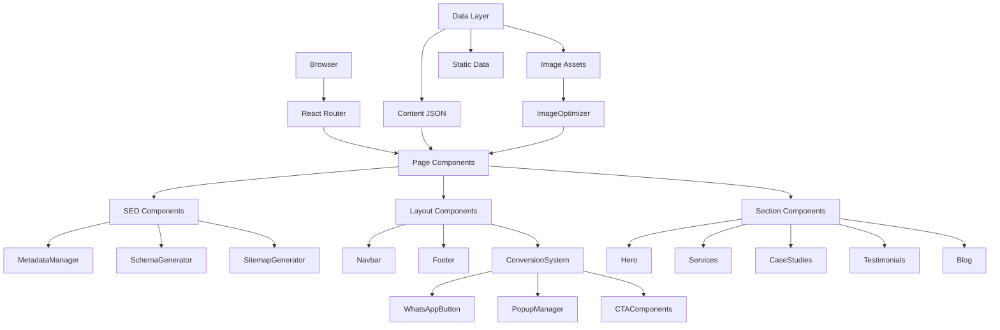

# Technical Design Document: SEO Agency Website Transformation

## Overview

This document specifies the technical design for transforming the FreelanceComm website from a single-page portfolio into a comprehensive, SEO-optimized AI Automation & SaaS Development Agency website. The transformation maintains the existing premium aesthetic (gold + black/cream palette, glassmorphism, 3D effects) while implementing a multi-page architecture with advanced SEO infrastructure, conversion optimization, and performance enhancements.

### Design Goals

1. **SEO Excellence**: Achieve 95+ Lighthouse SEO score through semantic HTML, metadata management, schema markup, and technical SEO best practices
2. **Performance**: Maintain 90+ mobile performance score with optimized images, code splitting, and lazy loading
3. **Scalability**: Support 16+ landing pages with dynamic routing and metadata
4. **Conversion Optimization**: Implement strategic CTAs, forms, popups, and trust signals to maximize lead generation
5. **Maintainability**: Create reusable components and clear data structures for easy content management
6. **Premium UX**: Enhance existing animations and interactions while maintaining 60fps performance

### Tech Stack

- **Framework**: React 18.3 with TypeScript 5.8
- **Build Tool**: Vite 5.4 with SWC for fast compilation
- **Routing**: React Router DOM 6.30 for multi-page navigation
- **Styling**: Tailwind CSS 3.4 with custom design tokens
- **Animation**: Framer Motion 12.38 for smooth transitions
- **UI Components**: shadcn/ui with Radix UI primitives
- **Forms**: React Hook Form 7.61 with Zod validation
- **SEO**: react-helmet-async for metadata management
- **Analytics**: Google Analytics 4 with web-vitals tracking

## Architecture

### High-Level System Architecture



### Folder Structure


```
src/
├── components/
│   ├── seo/
│   │   ├── MetadataManager.tsx      # Dynamic metadata for each page
│   │   ├── SchemaMarkup.tsx         # JSON-LD structured data
│   │   ├── Breadcrumbs.tsx          # Navigation breadcrumbs
│   │   └── SocialMeta.tsx           # Open Graph & Twitter Cards
│   ├── conversion/
│   │   ├── WhatsAppButton.tsx       # Floating WhatsApp CTA
│   │   ├── PopupManager.tsx         # Timed & exit-intent popups
│   │   ├── LeadForm.tsx             # Contact form with validation
│   │   ├── CalendlyEmbed.tsx        # Consultation scheduler
│   │   └── CTAButton.tsx            # Reusable CTA component
│   ├── trust/
│   │   ├── ClientLogos.tsx          # Client logo carousel
│   │   ├── Testimonials.tsx         # Client testimonial cards
│   │   ├── AnimatedCounter.tsx      # Stats counter animation
│   │   └── TrustBadges.tsx          # Security & quality badges
│   ├── sections/
│   │   ├── Hero.tsx                 # Homepage hero (existing)
│   │   ├── Services.tsx             # Services overview (existing)
│   │   ├── Projects.tsx             # Case studies showcase (existing)
│   │   ├── Reviews.tsx              # Testimonials section (existing)
│   │   ├── CTA.tsx                  # Call-to-action section (existing)
│   │   ├── Footer.tsx               # Footer with links (existing)
│   │   ├── ServiceHero.tsx          # Service page hero
│   │   ├── ProcessSection.tsx       # Development process
│   │   ├── TechStack.tsx            # Technology showcase
│   │   └── FAQSection.tsx           # Frequently asked questions
│   ├── blog/
│   │   ├── BlogCard.tsx             # Blog article preview card
│   │   ├── BlogList.tsx             # Blog listing page
│   │   ├── BlogPost.tsx             # Individual blog article
│   │   ├── TableOfContents.tsx      # Article TOC navigation
│   │   └── RelatedArticles.tsx      # Related content suggestions
│   ├── layout/
│   │   ├── PageLayout.tsx           # Base page wrapper
│   │   ├── Navbar.tsx               # Navigation header (existing)
│   │   └── MobileMenu.tsx           # Mobile navigation drawer
│   └── ui/                          # shadcn/ui components (existing)
├── pages/
│   ├── Index.tsx                    # Homepage (existing)
│   ├── NotFound.tsx                 # 404 error page (existing)
│   ├── services/
│   │   ├── WebDevelopment.tsx
│   │   ├── SaaSDevelopment.tsx
│   │   ├── AIAutomation.tsx
│   │   ├── FlutterDevelopment.tsx
│   │   ├── PortfolioWebsites.tsx
│   │   ├── StartupWebsites.tsx
│   │   ├── DashboardDevelopment.tsx
│   │   ├── ShopifyAutomation.tsx
│   │   └── CustomWebApps.tsx
│   ├── hiring/
│   │   ├── HireFullStackDeveloper.tsx
│   │   ├── HireReactDeveloper.tsx
│   │   └── HireFlutterDeveloper.tsx
│   ├── local/
│   │   ├── WebDevelopmentChennai.tsx
│   │   ├── AIAgencyIndia.tsx
│   │   ├── SaaSDevelopmentIndia.tsx
│   │   └── StartupAgencyChennai.tsx
│   ├── blog/
│   │   ├── BlogIndex.tsx            # Blog listing page
│   │   └── BlogArticle.tsx          # Dynamic blog article page
│   └── case-studies/
│       └── CaseStudyDetail.tsx      # Dynamic case study page
├── data/
│   ├── services.ts                  # Service page content
│   ├── blog-articles.ts             # Blog article metadata
│   ├── case-studies.ts              # Case study data
│   ├── testimonials.ts              # Client testimonials
│   ├── faqs.ts                      # FAQ content
│   └── metadata.ts                  # Page metadata configuration
├── lib/
│   ├── seo/
│   │   ├── generateSitemap.ts       # XML sitemap generator
│   │   ├── generateRobotsTxt.ts     # robots.txt generator
│   │   └── schema-helpers.ts        # Schema markup utilities
│   ├── analytics/
│   │   ├── gtag.ts                  # Google Analytics setup
│   │   └── track-events.ts          # Event tracking helpers
│   ├── image-optimizer.ts           # Image optimization utilities
│   └── utils.ts                     # General utilities (existing)
└── hooks/
    ├── useScrollSpy.ts              # Active section detection
    ├── useIntersectionObserver.ts   # Lazy loading & animations
    └── useFormValidation.ts         # Form validation logic
```

### Routing Architecture

The application uses React Router DOM with a hierarchical route structure:

```typescript
// Route Structure
/                                    → Homepage (Index.tsx)
/web-development                     → Service page
/saas-development                    → Service page
/ai-automation                       → Service page
/flutter-development                 → Service page
/portfolio-websites                  → Service page
/startup-websites                    → Service page
/dashboard-development               → Service page
/shopify-automation                  → Service page
/custom-web-applications             → Service page
/hire-full-stack-developer           → Hiring page
/hire-react-developer                → Hiring page
/hire-flutter-developer              → Hiring page
/web-development-chennai             → Local SEO page
/ai-agency-india                     → Local SEO page
/saas-development-india              → Local SEO page
/startup-agency-chennai              → Local SEO page
/blog                                → Blog listing
/blog/:slug                          → Individual blog article
/case-studies/:slug                  → Individual case study
*                                    → 404 page (NotFound.tsx)
```

## Components and Interfaces

### SEO Infrastructure Components

#### MetadataManager Component

**Purpose**: Dynamically manage page metadata for SEO optimization

**Interface**:
```typescript
interface MetadataConfig {
  title: string;                    // 50-60 characters
  description: string;              // 150-160 characters
  keywords?: string[];
  canonical?: string;
  ogImage?: string;
  ogType?: 'website' | 'article';
  twitterCard?: 'summary' | 'summary_large_image';
  author?: string;
  publishedTime?: string;
  modifiedTime?: string;
}

interface MetadataManagerProps {
  config: MetadataConfig;
  children?: React.ReactNode;
}
```

**Implementation Approach**:
- Use `react-helmet-async` for dynamic head management
- Generate canonical URLs automatically based on current route
- Include Open Graph and Twitter Card meta tags
- Set viewport, language, and charset meta tags
- Support article-specific metadata for blog posts

**Example Usage**:
```typescript
<MetadataManager config={{
  title: "AI Automation Agency | FreelanceComm",
  description: "Transform your business with AI automation solutions...",
  keywords: ["AI automation", "SaaS development", "web development"],
  canonical: "https://freelanccomm.in/ai-automation",
  ogImage: "/images/og-ai-automation.jpg",
  ogType: "website"
}} />
```

#### SchemaMarkup Component

**Purpose**: Generate JSON-LD structured data for rich search results

**Interface**:
```typescript
type SchemaType = 
  | 'Organization'
  | 'Service'
  | 'Article'
  | 'FAQPage'
  | 'BreadcrumbList'
  | 'LocalBusiness';

interface SchemaMarkupProps {
  type: SchemaType;
  data: Record<string, any>;
}
```

**Schema Templates**:

1. **Organization Schema** (Global):
```json
{
  "@context": "https://schema.org",
  "@type": "Organization",
  "name": "FreelanceComm",
  "url": "https://freelanccomm.in",
  "logo": "https://freelanccomm.in/logo.svg",
  "description": "AI Automation & SaaS Development Agency",
  "address": {
    "@type": "PostalAddress",
    "addressLocality": "Chennai",
    "addressRegion": "Tamil Nadu",
    "addressCountry": "IN"
  },
  "contactPoint": {
    "@type": "ContactPoint",
    "telephone": "+91-XXXXXXXXXX",
    "contactType": "Customer Service",
    "email": "contact@freelanccomm.in"
  },
  "sameAs": [
    "https://linkedin.com/company/freelanccomm",
    "https://github.com/freelanccomm",
    "https://twitter.com/freelanccomm"
  ]
}
```

2. **Service Schema** (Service Pages):
```json
{
  "@context": "https://schema.org",
  "@type": "Service",
  "serviceType": "AI Automation Development",
  "provider": {
    "@type": "Organization",
    "name": "FreelanceComm"
  },
  "areaServed": {
    "@type": "Country",
    "name": "India"
  },
  "description": "Custom AI automation solutions...",
  "offers": {
    "@type": "Offer",
    "availability": "https://schema.org/InStock"
  }
}
```

3. **Article Schema** (Blog Posts):
```json
{
  "@context": "https://schema.org",
  "@type": "Article",
  "headline": "10 AI Automation Tools for Startups",
  "author": {
    "@type": "Person",
    "name": "FreelanceComm Team"
  },
  "datePublished": "2024-01-15",
  "dateModified": "2024-01-20",
  "image": "https://freelanccomm.in/blog/ai-tools.jpg",
  "publisher": {
    "@type": "Organization",
    "name": "FreelanceComm",
    "logo": {
      "@type": "ImageObject",
      "url": "https://freelanccomm.in/logo.svg"
    }
  }
}
```

4. **FAQPage Schema** (FAQ Sections):
```json
{
  "@context": "https://schema.org",
  "@type": "FAQPage",
  "mainEntity": [
    {
      "@type": "Question",
      "name": "What is AI automation?",
      "acceptedAnswer": {
        "@type": "Answer",
        "text": "AI automation uses artificial intelligence..."
      }
    }
  ]
}
```

5. **BreadcrumbList Schema** (Navigation):
```json
{
  "@context": "https://schema.org",
  "@type": "BreadcrumbList",
  "itemListElement": [
    {
      "@type": "ListItem",
      "position": 1,
      "name": "Home",
      "item": "https://freelanccomm.in"
    },
    {
      "@type": "ListItem",
      "position": 2,
      "name": "Services",
      "item": "https://freelanccomm.in/services"
    },
    {
      "@type": "ListItem",
      "position": 3,
      "name": "AI Automation",
      "item": "https://freelanccomm.in/ai-automation"
    }
  ]
}
```

#### Breadcrumbs Component

**Purpose**: Provide navigation breadcrumbs with schema markup

**Interface**:
```typescript
interface BreadcrumbItem {
  label: string;
  href: string;
}

interface BreadcrumbsProps {
  items: BreadcrumbItem[];
  className?: string;
}
```

**Implementation**:
- Generate breadcrumbs automatically from route path
- Include BreadcrumbList schema markup
- Style with gold accent and separators
- Support keyboard navigation

### Conversion System Components

#### WhatsAppButton Component

**Purpose**: Floating WhatsApp CTA for instant messaging

**Interface**:
```typescript
interface WhatsAppButtonProps {
  phoneNumber: string;
  message?: string;
  position?: 'bottom-right' | 'bottom-left';
  showOnMobile?: boolean;
}
```

**Implementation**:
- Fixed position with z-index above content
- Smooth entrance animation on page load
- Pulse animation to draw attention
- Opens WhatsApp with pre-filled message
- Hide on scroll down, show on scroll up (mobile)

#### PopupManager Component

**Purpose**: Manage timed and exit-intent popups

**Interface**:
```typescript
interface PopupConfig {
  id: string;
  type: 'timed' | 'exit-intent' | 'scroll-depth';
  delay?: number;                   // For timed popups (ms)
  scrollPercentage?: number;        // For scroll-depth popups
  content: React.ReactNode;
  showOnce?: boolean;               // Use localStorage to show once
}

interface PopupManagerProps {
  popups: PopupConfig[];
}
```

**Implementation**:
- Track popup display in localStorage
- Detect exit intent (mouse leaving viewport)
- Track scroll depth for scroll-triggered popups
- Smooth fade-in animation with backdrop blur
- Close on backdrop click or ESC key
- Respect user preferences (don't spam)

#### LeadForm Component

**Purpose**: Contact form with validation and submission

**Interface**:
```typescript
interface LeadFormData {
  name: string;
  email: string;
  phone: string;
  service: string;
  message: string;
  honeypot?: string;                // Anti-spam field
}

interface LeadFormProps {
  onSubmit: (data: LeadFormData) => Promise<void>;
  variant?: 'inline' | 'popup' | 'sidebar';
  showServiceSelect?: boolean;
}
```

**Validation Rules**:
- Name: Required, min 2 characters
- Email: Required, valid email format
- Phone: Required, valid phone format (international)
- Service: Required if showServiceSelect is true
- Message: Required, min 10 characters
- Honeypot: Must be empty (spam prevention)

**Implementation**:
- Use React Hook Form with Zod validation
- Real-time validation with error messages
- Loading state during submission
- Success/error toast notifications
- Rate limiting (max 3 submissions per hour)

#### CTAButton Component

**Purpose**: Reusable call-to-action button with variants

**Interface**:
```typescript
interface CTAButtonProps {
  variant: 'primary' | 'secondary' | 'ghost' | 'outline';
  size?: 'sm' | 'md' | 'lg';
  href?: string;
  onClick?: () => void;
  icon?: React.ReactNode;
  children: React.ReactNode;
  className?: string;
}
```

**Variants**:
- **Primary**: Gold gradient background, dark text (existing `.btn-premium`)
- **Secondary**: Dark background, cream text
- **Ghost**: Transparent with gold border
- **Outline**: Cream background with dark border

### Trust Signal Components

#### ClientLogos Component

**Purpose**: Display client logos in a carousel

**Interface**:
```typescript
interface ClientLogo {
  name: string;
  logo: string;
  url?: string;
}

interface ClientLogosProps {
  logos: ClientLogo[];
  autoplay?: boolean;
  speed?: number;
}
```

**Implementation**:
- Infinite horizontal scroll animation
- Grayscale filter with color on hover
- Responsive grid on mobile
- Lazy load images

#### Testimonials Component

**Purpose**: Display client testimonials with ratings

**Interface**:
```typescript
interface Testimonial {
  id: string;
  name: string;
  role: string;
  company: string;
  avatar?: string;
  rating: number;
  text: string;
  project?: string;
}

interface TestimonialsProps {
  testimonials: Testimonial[];
  variant?: 'carousel' | 'grid';
}
```

**Implementation**:
- Card design with glassmorphism effect
- Star rating display
- Avatar with fallback initials
- Carousel with navigation dots
- Fade-in animation on scroll

#### AnimatedCounter Component

**Purpose**: Animated number counter for statistics

**Interface**:
```typescript
interface AnimatedCounterProps {
  end: number;
  duration?: number;
  suffix?: string;
  prefix?: string;
  decimals?: number;
}
```

**Implementation**:
- Trigger animation when element enters viewport
- Smooth easing function for natural counting
- Support for suffixes (K, M, +, %)
- Pause animation when out of view

#### TrustBadges Component

**Purpose**: Display security and quality badges

**Interface**:
```typescript
interface TrustBadge {
  icon: React.ReactNode;
  label: string;
  description?: string;
}

interface TrustBadgesProps {
  badges: TrustBadge[];
  layout?: 'horizontal' | 'grid';
}
```

**Badges**:
- Secure Development (lock icon)
- ISO Certified (certificate icon)
- 24/7 Support (clock icon)
- Money-Back Guarantee (shield icon)
- Trusted by 50+ Clients (users icon)

### Page Components

#### Service Landing Page Structure

Each service page follows this structure:

```typescript
interface ServicePageProps {
  service: {
    name: string;
    slug: string;
    tagline: string;
    description: string;
    benefits: string[];
    process: ProcessStep[];
    technologies: Technology[];
    caseStudies: CaseStudy[];
    faqs: FAQ[];
    pricing?: PricingTier[];
  };
}
```

**Sections**:
1. **Hero**: H1 with service name, tagline, CTA buttons
2. **Benefits**: Grid of key benefits with icons
3. **Process**: Step-by-step development process
4. **Technologies**: Tech stack showcase with logos
5. **Case Studies**: Related project showcases
6. **Testimonials**: Client reviews for this service
7. **FAQ**: Common questions with accordion
8. **CTA**: Final conversion section with form

#### Blog Article Structure

```typescript
interface BlogArticle {
  slug: string;
  title: string;
  excerpt: string;
  content: string;                  // Markdown or HTML
  author: string;
  publishedDate: string;
  modifiedDate?: string;
  featuredImage: string;
  category: string;
  tags: string[];
  readingTime: number;
  relatedArticles?: string[];       // Slugs of related articles
}
```

**Sections**:
1. **Hero**: Title, author, date, reading time, featured image
2. **Table of Contents**: Auto-generated from H2 headings
3. **Article Content**: Markdown rendered with syntax highlighting
4. **Social Sharing**: Share buttons for Twitter, LinkedIn, Facebook
5. **Related Articles**: 3-4 related blog posts
6. **CTA**: Newsletter signup or consultation offer

#### Case Study Structure

```typescript
interface CaseStudy {
  slug: string;
  title: string;
  client: {
    name: string;
    industry: string;
    logo?: string;
  };
  overview: string;
  problem: string;
  solution: string;
  techStack: string[];
  features: string[];
  results: {
    metric: string;
    value: string;
    description: string;
  }[];
  testimonial?: Testimonial;
  images: string[];
  liveUrl?: string;
  duration: string;
  team: string[];
}
```

**Sections**:
1. **Hero**: Project title, client info, hero image
2. **Overview**: Brief project description
3. **Problem**: Challenge the client faced
4. **Solution**: How FreelanceComm solved it
5. **Tech Stack**: Technologies used with logos
6. **Features**: Key features implemented
7. **Results**: Metrics and outcomes
8. **Testimonial**: Client feedback
9. **Gallery**: Project screenshots
10. **CTA**: Similar project inquiry

## Data Models

### Service Data Model

```typescript
interface Service {
  id: string;
  name: string;
  slug: string;
  tagline: string;
  description: string;
  icon: React.ReactNode;
  benefits: {
    title: string;
    description: string;
    icon: React.ReactNode;
  }[];
  process: {
    step: number;
    title: string;
    description: string;
    duration: string;
  }[];
  technologies: {
    name: string;
    logo: string;
    category: 'frontend' | 'backend' | 'database' | 'devops' | 'ai';
  }[];
  caseStudies: string[];            // Case study slugs
  faqs: {
    question: string;
    answer: string;
  }[];
  pricing?: {
    tier: string;
    price: string;
    features: string[];
    recommended?: boolean;
  }[];
  metadata: {
    title: string;
    description: string;
    keywords: string[];
  };
}
```

### Blog Article Data Model

```typescript
interface BlogArticle {
  slug: string;
  title: string;
  excerpt: string;
  content: string;
  author: {
    name: string;
    avatar?: string;
    bio?: string;
  };
  publishedDate: string;            // ISO 8601 format
  modifiedDate?: string;
  featuredImage: {
    url: string;
    alt: string;
    width: number;
    height: number;
  };
  category: string;
  tags: string[];
  readingTime: number;              // Minutes
  relatedArticles: string[];        // Slugs
  seo: {
    title: string;
    description: string;
    keywords: string[];
  };
}
```

### Case Study Data Model

```typescript
interface CaseStudy {
  slug: string;
  title: string;
  subtitle: string;
  client: {
    name: string;
    industry: string;
    logo?: string;
    website?: string;
  };
  overview: string;
  problem: string;
  solution: string;
  techStack: {
    name: string;
    logo: string;
    category: string;
  }[];
  features: {
    title: string;
    description: string;
  }[];
  results: {
    metric: string;
    value: string;
    description: string;
    icon: React.ReactNode;
  }[];
  testimonial?: {
    text: string;
    author: string;
    role: string;
    avatar?: string;
  };
  images: {
    url: string;
    alt: string;
    caption?: string;
  }[];
  liveUrl?: string;
  githubUrl?: string;
  duration: string;
  team: string[];
  services: string[];               // Related service slugs
  seo: {
    title: string;
    description: string;
    keywords: string[];
  };
}
```

### Testimonial Data Model

```typescript
interface Testimonial {
  id: string;
  name: string;
  role: string;
  company: string;
  avatar?: string;
  rating: number;                   // 1-5
  text: string;
  project?: string;
  service?: string;
  date: string;
  featured?: boolean;
}
```

### FAQ Data Model

```typescript
interface FAQ {
  id: string;
  question: string;
  answer: string;
  category: string;
  order: number;
}
```

## Error Handling

### Error Boundaries

Implement React Error Boundaries to catch and handle component errors gracefully:

```typescript
interface ErrorBoundaryState {
  hasError: boolean;
  error?: Error;
}

class ErrorBoundary extends React.Component<
  { children: React.ReactNode },
  ErrorBoundaryState
> {
  // Catch errors in child components
  // Display fallback UI
  // Log errors to monitoring service
}
```

### Form Error Handling

- Display field-specific validation errors inline
- Show toast notifications for submission errors
- Implement retry logic for network failures
- Provide clear error messages with actionable guidance

### 404 Error Page

- Custom 404 page with search functionality
- Links to popular pages (homepage, services, blog, contact)
- Maintain design aesthetic with gold accents
- Track 404 errors in analytics for broken link detection

### Network Error Handling

- Display user-friendly error messages for API failures
- Implement exponential backoff for retries
- Provide offline fallback content where possible
- Show loading states during network requests

## Testing Strategy

### Unit Testing

**Focus Areas**:
- Utility functions (SEO helpers, image optimization, validation)
- Form validation logic
- Data transformation functions
- Schema markup generation

**Tools**: Vitest, Testing Library

**Example Tests**:
- Metadata generation produces correct title/description
- Schema markup validates against schema.org
- Form validation catches invalid inputs
- Image optimizer generates correct srcset

### Integration Testing

**Focus Areas**:
- Page routing and navigation
- Form submission flows
- Popup trigger logic
- Analytics event tracking

**Example Tests**:
- Navigating to service page loads correct content
- Submitting contact form triggers success message
- Exit-intent popup appears when mouse leaves viewport
- CTA button click tracks analytics event

### E2E Testing

**Focus Areas**:
- Critical user journeys
- Conversion flows
- Mobile responsiveness
- Performance benchmarks

**Tools**: Playwright or Cypress

**Example Tests**:
- User can navigate from homepage to service page to contact form
- User can submit lead form and receive confirmation
- Mobile menu opens and closes correctly
- Page loads within performance budget

### Performance Testing

**Metrics to Track**:
- Lighthouse scores (Performance, SEO, Accessibility, Best Practices)
- Core Web Vitals (LCP, FID, CLS)
- Bundle size (initial, lazy-loaded chunks)
- Image optimization effectiveness

**Tools**: Lighthouse CI, web-vitals library

**Thresholds**:
- Mobile Performance: 90+
- SEO: 95+
- Accessibility: 95+
- LCP: < 2.5s
- FID: < 100ms
- CLS: < 0.1
- Initial bundle: < 200KB gzipped

### SEO Testing

**Validation**:
- All pages have unique title and description
- Schema markup validates on schema.org validator
- Sitemap includes all pages
- Robots.txt allows crawling
- Canonical URLs are correct
- Internal links are not broken
- Images have alt text
- Heading hierarchy is correct

**Tools**: Google Search Console, Screaming Frog, Lighthouse


## Implementation Approach

### Phase 1: Foundation & Infrastructure (Week 1)

**Goal**: Set up routing, SEO infrastructure, and base components

**Tasks**:
1. Install dependencies: `react-helmet-async`, `react-router-dom` (already installed)
2. Create routing structure in `App.tsx` with all service, hiring, local, and blog routes
3. Implement `MetadataManager` component with react-helmet-async
4. Implement `SchemaMarkup` component with JSON-LD generation
5. Create `PageLayout` wrapper component with metadata and schema
6. Implement `Breadcrumbs` component with schema markup
7. Create sitemap generator utility (`lib/seo/generateSitemap.ts`)
8. Create robots.txt generator utility (`lib/seo/generateRobotsTxt.ts`)
9. Set up data files for services, blog articles, case studies, testimonials, FAQs

**Deliverables**:
- Working multi-page routing
- Dynamic metadata on all pages
- Schema markup on all pages
- Sitemap and robots.txt generation

### Phase 2: Service Landing Pages (Week 2)

**Goal**: Create 9 service landing pages with SEO optimization

**Tasks**:
1. Create `ServiceHero` component with H1, tagline, CTA buttons
2. Create `ProcessSection` component with step-by-step process
3. Create `TechStack` component with technology logos
4. Create `FAQSection` component with accordion UI
5. Populate service data in `data/services.ts`
6. Create service page template component
7. Implement all 9 service pages using template
8. Add internal linking between related services
9. Optimize images for service pages
10. Write unique content for each service (1500+ words)

**Deliverables**:
- 9 fully functional service landing pages
- Unique metadata and schema for each page
- Internal linking structure
- FAQ sections with schema markup

### Phase 3: Hiring & Local SEO Pages (Week 3)

**Goal**: Create hiring and local SEO landing pages

**Tasks**:
1. Create hiring page template with developer profiles
2. Implement 3 hiring pages (Full Stack, React, Flutter)
3. Create local SEO page template
4. Implement 4 local pages (Chennai, India variations)
5. Add LocalBusiness schema markup for local pages
6. Add Google Maps embed or location information
7. Write unique content for each page (1200+ words)

**Deliverables**:
- 3 hiring landing pages
- 4 local SEO landing pages
- LocalBusiness schema markup
- Location-specific content

### Phase 4: Blog System (Week 4)

**Goal**: Implement blog listing and article pages

**Tasks**:
1. Create `BlogCard` component for article previews
2. Create `BlogList` page with filtering and pagination
3. Create `BlogPost` component with article rendering
4. Create `TableOfContents` component with anchor links
5. Create `RelatedArticles` component
6. Populate blog article data in `data/blog-articles.ts`
7. Write 10 initial blog articles (1500+ words each)
8. Add Article schema markup to blog posts
9. Implement social sharing buttons
10. Add reading time calculation

**Deliverables**:
- Blog listing page with filtering
- Individual blog article pages
- 10 published blog articles
- Article schema markup
- Social sharing functionality

### Phase 5: Case Studies (Week 5)

**Goal**: Create detailed case study pages

**Tasks**:
1. Create `CaseStudyDetail` page component
2. Populate case study data in `data/case-studies.ts`
3. Create 6 initial case studies with detailed content
4. Add high-quality project images
5. Implement image gallery with lightbox
6. Add case study schema markup
7. Link case studies to related services

**Deliverables**:
- 6 detailed case study pages
- Image galleries
- Case study schema markup
- Internal linking to services

### Phase 6: Conversion System (Week 6)

**Goal**: Implement conversion optimization components

**Tasks**:
1. Create `WhatsAppButton` component with floating position
2. Create `PopupManager` component with timed/exit-intent logic
3. Create `LeadForm` component with validation
4. Create `CalendlyEmbed` component
5. Create `CTAButton` component with variants
6. Implement popup configurations for different pages
7. Add conversion tracking events
8. Implement form submission handling
9. Add honeypot spam prevention
10. Test conversion flows

**Deliverables**:
- Floating WhatsApp button
- Timed and exit-intent popups
- Contact forms with validation
- Calendly integration
- Conversion event tracking

### Phase 7: Trust Signals (Week 7)

**Goal**: Implement trust and credibility components

**Tasks**:
1. Create `ClientLogos` component with carousel
2. Create `Testimonials` component with cards
3. Create `AnimatedCounter` component
4. Create `TrustBadges` component
5. Populate testimonial data
6. Add client logos
7. Implement scroll-triggered animations
8. Add trust signals to homepage and service pages

**Deliverables**:
- Client logo carousel
- Testimonial cards
- Animated stat counters
- Trust badges

### Phase 8: Performance Optimization (Week 8)

**Goal**: Optimize performance and achieve Lighthouse targets

**Tasks**:
1. Implement image optimization (WebP conversion, lazy loading)
2. Implement code splitting for routes
3. Optimize bundle size (tree shaking, minification)
4. Implement font preloading
5. Add service worker for caching
6. Optimize Framer Motion animations
7. Implement responsive images with srcset
8. Run Lighthouse audits and fix issues
9. Achieve Core Web Vitals thresholds
10. Test on mobile devices

**Deliverables**:
- Lighthouse Performance: 90+
- Lighthouse SEO: 95+
- Lighthouse Accessibility: 95+
- Core Web Vitals: LCP < 2.5s, FID < 100ms, CLS < 0.1
- Bundle size < 200KB gzipped

### Phase 9: Analytics & Tracking (Week 9)

**Goal**: Implement analytics and monitoring

**Tasks**:
1. Set up Google Analytics 4
2. Implement event tracking for CTAs
3. Track form submissions
4. Track scroll depth
5. Implement Core Web Vitals tracking
6. Set up Google Search Console
7. Implement error tracking (Sentry or similar)
8. Add cookie consent banner
9. Test analytics events
10. Create analytics dashboard

**Deliverables**:
- GA4 integration
- Event tracking for all CTAs
- Core Web Vitals monitoring
- Error tracking
- Cookie consent

### Phase 10: Testing & Launch (Week 10)

**Goal**: Comprehensive testing and production deployment

**Tasks**:
1. Write unit tests for utilities
2. Write integration tests for forms
3. Run E2E tests for critical flows
4. Test on multiple browsers (Chrome, Safari, Firefox, Edge)
5. Test on multiple devices (iOS, Android, desktop)
6. Validate all schema markup
7. Check all internal links
8. Verify sitemap and robots.txt
9. Run final Lighthouse audits
10. Deploy to production

**Deliverables**:
- Comprehensive test coverage
- Cross-browser compatibility
- Mobile responsiveness
- Production deployment
- Post-launch monitoring

## Technical SEO Implementation Details

### Sitemap Generation

**File**: `lib/seo/generateSitemap.ts`

```typescript
interface SitemapEntry {
  url: string;
  lastmod: string;
  changefreq: 'always' | 'hourly' | 'daily' | 'weekly' | 'monthly' | 'yearly' | 'never';
  priority: number;
}

function generateSitemap(entries: SitemapEntry[]): string {
  // Generate XML sitemap
  // Include all pages with appropriate priority
  // Homepage: priority 1.0, changefreq daily
  // Service pages: priority 0.9, changefreq weekly
  // Blog articles: priority 0.7, changefreq monthly
  // Case studies: priority 0.8, changefreq monthly
}
```

**Priority Guidelines**:
- Homepage: 1.0
- Service pages: 0.9
- Hiring pages: 0.8
- Local SEO pages: 0.8
- Case studies: 0.8
- Blog articles: 0.7
- Blog listing: 0.6

### Robots.txt Configuration

**File**: `public/robots.txt`

```
User-agent: *
Allow: /
Disallow: /admin/
Disallow: /api/

Sitemap: https://freelanccomm.in/sitemap.xml
```

### Canonical URL Strategy

- Set canonical URL on every page to prevent duplicate content
- Use absolute URLs (https://freelanccomm.in/page-path)
- Ensure consistency across all pages
- Handle trailing slashes consistently (prefer without)

### Internal Linking Strategy

**Navigation Links**:
- Header: Services dropdown, Blog, Case Studies, Contact
- Footer: All service pages, hiring pages, blog, about, contact, privacy, terms

**Contextual Links**:
- Service pages link to related services (3-5 links)
- Blog articles link to related articles (3-4 links)
- Case studies link to related services
- Homepage links to all primary services

**Anchor Text Guidelines**:
- Use descriptive anchor text with keywords
- Avoid generic "click here" or "read more"
- Example: "Learn more about our AI automation services"

## Performance Optimization Details

### Image Optimization Strategy

**Implementation**:
1. Convert all images to WebP format with JPEG fallback
2. Generate multiple sizes for responsive images
3. Use `loading="lazy"` for below-fold images
4. Use `loading="eager"` for hero images
5. Include width and height attributes to prevent CLS
6. Compress images to 60-80% quality

**Responsive Image Sizes**:
- Mobile: 320px, 640px
- Tablet: 768px, 1024px
- Desktop: 1280px, 1920px

**Example**:
```tsx

```

### Code Splitting Strategy

**Route-Based Splitting**:
```typescript
// Lazy load page components
const WebDevelopment = lazy(() => import('./pages/services/WebDevelopment'));
const SaaSDevelopment = lazy(() => import('./pages/services/SaaSDevelopment'));
const BlogIndex = lazy(() => import('./pages/blog/BlogIndex'));
const BlogArticle = lazy(() => import('./pages/blog/BlogArticle'));

// Wrap in Suspense with loading fallback
<Suspense fallback={<PageLoader />}>
  <Routes>
    <Route path="/web-development" element={<WebDevelopment />} />
    <Route path="/saas-development" element={<SaaSDevelopment />} />
    <Route path="/blog" element={<BlogIndex />} />
    <Route path="/blog/:slug" element={<BlogArticle />} />
  </Routes>
</Suspense>
```

**Component-Based Splitting**:
- Split heavy components (3D models, charts, animations)
- Load on demand when user interacts
- Use dynamic imports with React.lazy

### Font Optimization

**Preload Critical Fonts**:
```html
<link rel="preload" href="/fonts/Fraunces-Bold.woff2" as="font" type="font/woff2" crossorigin>
<link rel="preload" href="/fonts/DMSans-Regular.woff2" as="font" type="font/woff2" crossorigin>
```

**Font Display Strategy**:
```css
@font-face {
  font-family: 'Fraunces';
  src: url('/fonts/Fraunces-Bold.woff2') format('woff2');
  font-weight: 700;
  font-display: swap; /* Prevent FOIT, allow FOUT */
}
```

### Animation Performance

**Framer Motion Optimization**:
- Use `transform` and `opacity` for animations (GPU-accelerated)
- Avoid animating `width`, `height`, `top`, `left` (causes reflow)
- Use `will-change` sparingly for complex animations
- Reduce motion for users with `prefers-reduced-motion`

**Example**:
```tsx
<motion.div
  initial={{ opacity: 0, y: 20 }}
  animate={{ opacity: 1, y: 0 }}
  transition={{ duration: 0.6, ease: [0.16, 1, 0.3, 1] }}
  style={{ willChange: 'transform, opacity' }}
>
  {content}
</motion.div>
```

### Bundle Size Optimization

**Strategies**:
1. Tree shaking: Import only used components from libraries
2. Minification: Vite handles automatically in production
3. Compression: Enable gzip/brotli on server
4. Analyze bundle: Use `vite-bundle-visualizer`
5. Remove unused dependencies
6. Use lighter alternatives where possible

**Target Bundle Sizes**:
- Initial bundle: < 200KB gzipped
- Lazy-loaded chunks: < 100KB each
- Total JavaScript: < 500KB gzipped

## Analytics Implementation Details

### Google Analytics 4 Setup

**File**: `lib/analytics/gtag.ts`

```typescript
// Initialize GA4
export const GA_MEASUREMENT_ID = 'G-XXXXXXXXXX';

export const pageview = (url: string) => {
  window.gtag('config', GA_MEASUREMENT_ID, {
    page_path: url,
  });
};

export const event = (action: string, params?: Record<string, any>) => {
  window.gtag('event', action, params);
};
```

**Event Tracking**:
```typescript
// Track CTA clicks
event('cta_click', {
  cta_location: 'hero',
  cta_text: 'Start a Project',
  page_path: window.location.pathname,
});

// Track form submissions
event('form_submit', {
  form_type: 'contact',
  service_interest: 'AI Automation',
});

// Track scroll depth
event('scroll_depth', {
  depth: '75%',
  page_path: window.location.pathname,
});
```

### Core Web Vitals Tracking

**File**: `lib/analytics/track-events.ts`

```typescript
import { getCLS, getFID, getFCP, getLCP, getTTFB } from 'web-vitals';

function sendToAnalytics(metric: Metric) {
  event('web_vitals', {
    metric_name: metric.name,
    metric_value: metric.value,
    metric_delta: metric.delta,
    metric_id: metric.id,
  });
}

getCLS(sendToAnalytics);
getFID(sendToAnalytics);
getFCP(sendToAnalytics);
getLCP(sendToAnalytics);
getTTFB(sendToAnalytics);
```

## Security Implementation

### Form Security

**CSRF Protection**:
- Generate CSRF token on page load
- Include token in form submissions
- Validate token on server

**Input Sanitization**:
```typescript
import DOMPurify from 'dompurify';

function sanitizeInput(input: string): string {
  return DOMPurify.sanitize(input, {
    ALLOWED_TAGS: [],
    ALLOWED_ATTR: [],
  });
}
```

**Rate Limiting**:
```typescript
// Client-side rate limiting
const RATE_LIMIT = 3; // Max submissions per hour
const RATE_WINDOW = 60 * 60 * 1000; // 1 hour in ms

function checkRateLimit(): boolean {
  const submissions = JSON.parse(
    localStorage.getItem('form_submissions') || '[]'
  );
  const now = Date.now();
  const recentSubmissions = submissions.filter(
    (time: number) => now - time < RATE_WINDOW
  );
  return recentSubmissions.length < RATE_LIMIT;
}
```

### Content Security Policy

**Headers**:
```
Content-Security-Policy: 
  default-src 'self';
  script-src 'self' 'unsafe-inline' https://www.googletagmanager.com;
  style-src 'self' 'unsafe-inline';
  img-src 'self' data: https:;
  font-src 'self' data:;
  connect-src 'self' https://www.google-analytics.com;
  frame-src https://calendly.com;
```

## Deployment Strategy

### Build Configuration

**Vite Production Build**:
```typescript
// vite.config.ts
export default defineConfig({
  build: {
    target: 'es2015',
    minify: 'terser',
    terserOptions: {
      compress: {
        drop_console: true,
        drop_debugger: true,
      },
    },
    rollupOptions: {
      output: {
        manualChunks: {
          vendor: ['react', 'react-dom', 'react-router-dom'],
          animations: ['framer-motion'],
          ui: ['@radix-ui/react-dialog', '@radix-ui/react-accordion'],
        },
      },
    },
  },
});
```

### Environment Variables

```env
VITE_GA_MEASUREMENT_ID=G-XXXXXXXXXX
VITE_SITE_URL=https://freelanccomm.in
VITE_WHATSAPP_NUMBER=+91XXXXXXXXXX
VITE_CALENDLY_URL=https://calendly.com/freelanccomm
```

### Deployment Checklist

- [ ] Run production build: `npm run build`
- [ ] Test production build locally: `npm run preview`
- [ ] Run Lighthouse CI checks
- [ ] Verify all environment variables are set
- [ ] Generate sitemap and robots.txt
- [ ] Test on staging environment
- [ ] Verify analytics tracking
- [ ] Check all forms work correctly
- [ ] Verify all images load correctly
- [ ] Test on multiple browsers and devices
- [ ] Deploy to production
- [ ] Monitor error logs
- [ ] Submit sitemap to Google Search Console
- [ ] Monitor Core Web Vitals in Search Console

## Maintenance and Monitoring

### Regular Tasks

**Weekly**:
- Review analytics data
- Check for broken links
- Monitor Core Web Vitals
- Review error logs

**Monthly**:
- Update blog with new articles
- Add new case studies
- Update testimonials
- Review and update service content
- Check Lighthouse scores
- Review Search Console data

**Quarterly**:
- Audit SEO performance
- Update dependencies
- Review and optimize bundle size
- Conduct accessibility audit
- Update schema markup if needed

### Monitoring Tools

- **Uptime**: UptimeRobot or Pingdom
- **Analytics**: Google Analytics 4
- **Search Performance**: Google Search Console
- **Error Tracking**: Sentry
- **Performance**: Lighthouse CI, web-vitals
- **SEO**: Ahrefs or SEMrush

## Conclusion

This design document provides a comprehensive technical specification for transforming the FreelanceComm website into an SEO-optimized, high-converting AI Automation & SaaS Development Agency website. The implementation follows a phased approach over 10 weeks, with clear deliverables and success metrics at each stage.

The architecture maintains the existing premium aesthetic while adding robust SEO infrastructure, conversion optimization, and performance enhancements. The design prioritizes scalability, maintainability, and user experience, ensuring the website can grow with the business while maintaining excellent search engine rankings and conversion rates.

**Key Success Metrics**:
- Lighthouse SEO Score: 95+
- Lighthouse Performance Score: 90+ (mobile)
- Lighthouse Accessibility Score: 95+
- Core Web Vitals: All metrics in "Good" range
- 16+ SEO-optimized landing pages
- 10+ published blog articles
- 6+ detailed case studies
- Conversion rate improvement: 2x baseline

